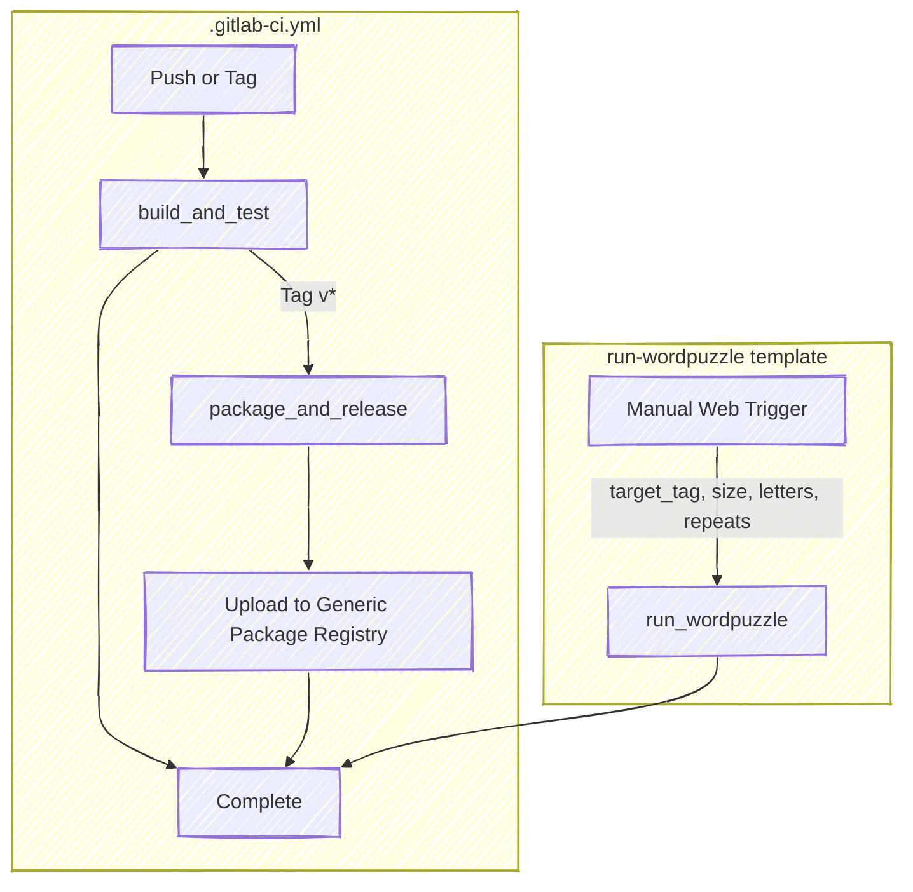
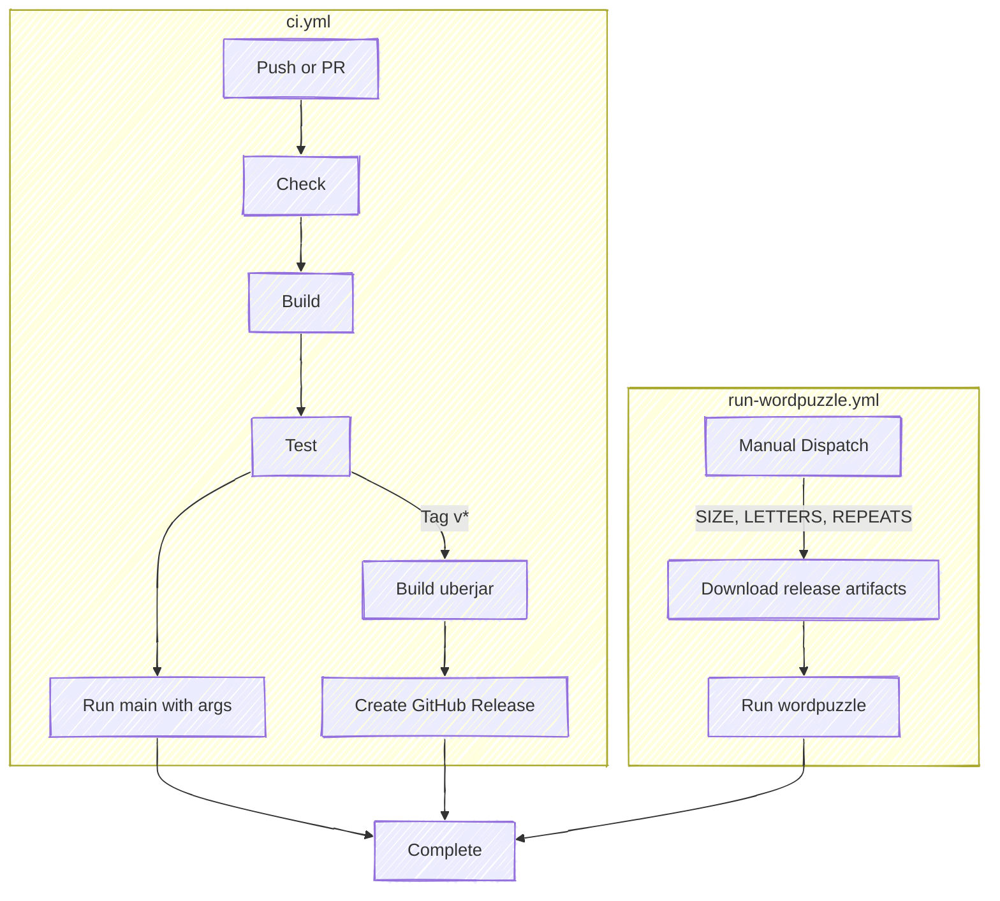

# Clojure Solution to Word Puzzles

Explore Clojure to solve [9 Letter word
Puzzle](https://nineletterword.tompaton.com/adevcrsoi/) and
[NYT Spelling Bee](https://www.nytimes.com/puzzles/spelling-bee) puzzles.

See also the other language solutions:

- [Haskell](https://gitlab.com/frankhjung1/haskell-wordpuzzle)
- [Java](https://gitlab.com/frankhjung1/java-wordpuzzle)
- [Kotlin](https://gitlab.com/frankhjung1/kotlin-wordpuzzle)
- [Go](https://gitlab.com/frankhjung1/go-wordpuzzle)
- [Python](https://gitlab.com/frankhjung1/python-wordpuzzle)

## Build

This project provides convenient `Makefile` targets that wrap common
Leiningen tasks. Use `make` for local development; the `cicd` prefixed
targets are provided for pipeline usage.

Common targets:

- `make` - default: `clean fmt check compile test`
- `make compile` - compile sources
- `make test` - run tests
- `make run` - run example puzzles using the dev profile
- `make uberjar` - build a standalone (über) JAR

You can still run Leiningen directly if you prefer:

```bash
lein with-profile dev test
```

## Run

```bash
$ lein run -- --help

NAME

  Solve word puzzles like those at nineletterword.tompaton.com and NYT Spelling Bee

SYNOPSIS

  wordpuzzle.main [-h|--help]
  wordpuzzle.main [-d|--dictionary PATH] [-s|--size INT] <-l|--letters STRING> [-r|--repeats]

DESCRIPTION

  List all valid words using provided letters.  Each word must contain
  the mandatory letter which is the first character in the letters list.

OPTIONS

  -h, --help                                     This help text
  -d, --dictionary STRING  resources/dictionary  Alternate word dictionary
  -s, --size INT           4                     Minimum word size
  -l, --letters STRING                           [REQUIRED] 7+ lowercase letters to make words
  -r, --repeats                                  Letters can be repeated (e.g., Spelling Bee)

LICENSE

  Copyright © 2022-2026 Frank H Jung, MIT License
```

### Run puzzle solver

Use the `make run` target (runs the project under the `dev` profile):

```bash
make run
```

Or run directly with Leiningen:

```bash
lein with-profile dev run -- --size=4 --letters=cadevrsoi
```

### Run Spelling Bee puzzle

```bash
lein with-profile dev run -- --size=4 --letters=mitncao --repeats
```

### Run standalone jar

Build a standalone (Über) JAR with the Makefile target or Leiningen:

```bash
make uberjar
# or for CI-style profile combination
lein with-profile cicd,uberjar uberjar
```

Run the standalone jar (build first using `make uberjar` or via CI):

```bash
make run-uberjar
```

Or manually with Java (replace `*` with the version from the release):

```bash
java -jar target/uberjar/wordpuzzle-*-standalone.jar \
  --size=7 --letters=cadevrsoi --dictionary=resources/dictionary
```

## Releases

The CI pipelines build and publish an uberjar on every git tag
matching `v*`:

- **GitLab** — creates a GitLab Release and uploads the tarball to
  the Generic Package Registry. Download from the
  [GitLab releases page](https://gitlab.com/frankhjung1/clojure-wordpuzzle/-/releases)
  or trigger the manual `run_wordpuzzle` pipeline.
- **GitHub** — creates a GitHub Release with the standalone JAR and
  dictionary attached as assets. Download from the
  [GitHub releases page](https://github.com/frankhjung1/clojure-wordpuzzle/releases)
  or trigger the manual `Run Wordpuzzle` workflow.

### Tagging a Release

Release tags follow [Semantic Versioning](https://semver.org/) and
must be prefixed with `v` (e.g. `v1.0.0`). To create a release:

1. Update the version in `project.clj`:

   ```clojure
   (defproject wordpuzzle "1.0.0"
   ```

2. Commit and tag:

   ```bash
   git add project.clj
   git commit -m "Release v1.0.0"
   git tag v1.0.0
   ```

3. Push the commit and tag:

   ```bash
   git push origin master --tags
   ```

The tag push triggers the release jobs on both GitLab
(`package_and_release`) and GitHub (`Create/Update Release`).

## GitLab CI Workflow

The pipeline has three jobs across two stages. The diagram below
shows how they connect for normal pushes, tag releases, and manual
web-triggered runs.



- **`build_and_test`** — runs on every non-web push;
  `lein check, compile, test, uberjar`; produces an uberjar
  and dictionary as artifacts.
- **`package_and_release`** — runs on tag pushes (`^v`); stages
  JAR and dictionary flat, tars them, uploads to the GitLab
  Generic Package Registry, and creates a GitLab Release.
- **`run_wordpuzzle`** — manually triggered from the GitLab web
  UI; downloads the tarball for the given `target_tag`, extracts
  it, and runs `java -jar wordpuzzle-*-standalone.jar` with
  `size`, `letters`, and `repeats` inputs.

## GitHub Actions Workflow

The project also has GitHub Actions workflows. The `ci.yml` workflow
builds, tests, and optionally releases on tag pushes. The
`run-wordpuzzle.yml` workflow is manually triggered to run the puzzle
solver using a release artifact.



- **`build-test-run`** — runs on every push and pull request;
  `lein check, compile, test`; on tag pushes (`v*`), also builds
  an uberjar and creates a GitHub Release with the JAR and
  dictionary.
- **`run-wordpuzzle`** — manually triggered via workflow dispatch;
  downloads the uberjar and dictionary from the latest release,
  then runs `java -jar wordpuzzle-*-standalone.jar` with `SIZE`,
  `LETTERS`, and `REPEATS` inputs.

## Updating dependencies

Dependencies for the project are defined in `project.clj`. After
changing versions (or adding new libraries) simply fetch them with:

```bash
lein deps
```

The project already includes the `lein-ancient` plugin, which can
inspect and upgrade out‑of‑date coordinates:

```bash
# show any dependencies that have newer releases available
lein ancient

# automatically update `project.clj` to use the latest versions
lein ancient upgrade
```

Remember to run `lein deps` again after editing `project.clj` to
pull down any new artifacts.

## LICENSE

[LICENSE](LICENSE)
